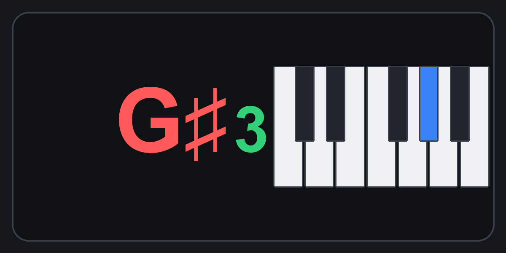

# Stream Deck+ — MIDI value as a note name (+ piano)

Show a raw **MIDI value** (0–127) as a **note name** — and optionally a little
**one-octave piano** with the current key lit — on a **Stream Deck +** dial (or
key), using the [Trevliga Spel MIDI plugin](https://trevligaspel.se/streamdeck/midi/).

My use case: a **keyboard split point** sent as `CC 103 / channel 2`. On stage
"split at 60" means nothing; **"C4"** (with the key lit on a mini-keyboard) reads
instantly.


*Clean render of the dial display — split point at C♯4. (Actual on-device screen is
tiny/low-res; these are high-res mockups. See `images/vision/`.)*

**How the display is built** — three fields, all driven from the raw MIDI value:


---

## Two ways to do it

### A. Note name from a formula — on a Scripted Dial *(what I use)*

A dial can be turned +/- to adjust the split, so the control lives on a dial.
A `Scripted Dial` computes the note name straight from the value — no lookup file:

- **letter** from `value % 12` → shown in `{title}`
- **octave** from `INT(value / 12) - 1` → shown in `{text}`  (C4 = middle C = 60)
- **piano** via `{iconright:.../kbd_#value%12#.png}` — one small image per note

Full script: [`midiscript/split_note_dial.midiscript`](midiscript/split_note_dial.midiscript).
The note-letter formula (the interesting bit):

```
IF(v%12=0,"C",IF(v%12=1,"C♯",IF(v%12=2,"D",IF(v%12=3,"D♯",IF(v%12=4,"E",
IF(v%12=5,"F",IF(v%12=6,"F♯",IF(v%12=7,"G",IF(v%12=8,"G♯",IF(v%12=9,"A",
IF(v%12=10,"A♯","B"))))))))))
```
`v` = `@e_ccvalue` on receive, `@e_value` on rotate.

### B. Note name from a translation file — on a Cycle key

The plugin author (Gunnar) suggested a **translation file**: an XML mapping every
value 0–127 to a display string (and/or image). That works on a **Cycle key**
(the whole key face is the image). Generated here:
[`translation-files/note-names-C4-60.xml`](translation-files/note-names-C4-60.xml)
(plus a `C3=60` variant).

---

## One image per note

For the piano I render **12 small images**, one per note of the octave —
`kbd_0.png` = C lit, `kbd_1.png` = C♯ … `kbd_11.png` = B. The script picks the
right one with `value % 12` in the path, so the lit key follows the split point.
See [`images/keyboard-icons/`](images/keyboard-icons/).

---

## Placing note + octave together (custom layout)

By default the letter sits top-centre and the octave lands elsewhere — they don't
read as one token. Gunnar's tip fixes this: a **custom layout** JSON gives every
object an explicit `rect` (`[x, y, w, h]` on a 200×100 canvas) and an
**`alignment`**, so you place the note letter and the octave side by side as a
single **`G♯3`** unit, with the piano pinned to the right.



The trick that keeps it clean (see [`layouts/ts_note_split.json`](layouts/ts_note_split.json)):

- **`note_letter`** — `alignment: "right"`, its box ends at the seam (`x = 90`).
  The letter grows *leftward*, so a wide `G♯` and a narrow `C` both end at the same x.
- **`note_octave`** — `alignment: "left"`, its box starts at the seam (`x = 92`).
  Fixed x ⇒ the octave never jumps when the accidental changes width (this is the
  old "keep them in separate fields" gotcha, now solved by geometry instead of luck).
- **`keyboard`** — a `pixmap` pinned on the right (`x = 108`).

**It's pure MidiScript — no JavaScript needed.** `{layout:…}` and `{@l_key…}` are
standard MidiScript actions ([plugin docs: Custom layouts → Scripting](https://trevligaspel.se/streamdeck/midi/index.php/script/midiscript/custom-layouts/custom-layouts-scripting)):

- `{layout:PATH}` loads the JSON **and** ticks the "Use a custom layout" checkbox.
- Because the layout uses its *own* object keys (not the plugin's built-in ones),
  nothing auto-populates them — the script enables and fills each one:
  `{@l_note_letter.enabled:true}` then `{@l_note_letter:G♯}`, etc.
- **Object keys must start with `l_`** so the script variables stay *local* to the
  dial (a key without the prefix becomes a global variable).

Full script: [`midiscript/split_note_dial_custom_layout.midiscript`](midiscript/split_note_dial_custom_layout.midiscript).
Copy `ts_note_split.json` into `~/Documents/Trevliga Spel/Layouts/`, paste the
script into the dial, and adjust the CC/channel + paths.

**Two rejection traps** — Stream Deck silently ignores the *entire* layout if any
object extends beyond the **200×100 canvas**, or if two objects with the **same
`zOrder`** overlap (even by one pixel). Give every object a distinct `zOrder`.

---

## Gotchas learned the hard way

- **Sharp must be `♯` (U+266F), NOT ASCII `#`.** A literal `#` inside a note name
  terminates the surrounding `#…#` expression and breaks the MidiScript parser.
  Use the real MUSIC SHARP SIGN glyph.
- **Tabs are not honoured** by the dial screen — `\t` won't align anything.
- **Keep letter and octave in separate fields** (`{title}` + `{text}`). Then the
  width of the sharp never shifts the octave — it stays put as you turn.
- **A dial cannot show a big, per-value full-screen image.** Per value you only get
  text + small side icons (`{iconleft}`/`{iconright}`). "Show large icons" only
  enlarges the static on/off **state** icon (an XML, not per value) — not a
  per-value keyboard. A big per-value image needs a **key** (`{image:}` fills the
  face). A key, though, can't do +/- — so for a split you stay on the dial.
- **Placing letter + octave freely — solved with a custom layout.** I originally
  filed this as a wishlist ("let title *and* text both sit on the left, next to the
  keyboard"). Gunnar (the plugin author) pointed out it's already possible: each
  display object's position is set by its own `rect` + **`alignment`** in a
  **custom layout** JSON. See [Placing note + octave together](#placing-note--octave-together-custom-layout) below.

---

## Reproduce

```bash
pip install pillow
python3 scripts/gen_keyboard_icons.py     # -> images/keyboard-icons/kbd_0..11.png
python3 scripts/gen_note_translation.py   # -> translation-files/note-names-*.xml
python3 scripts/gen_dial_full_images.py    # -> optional full landscape dial images
```

Then, in Stream Deck:
1. Copy `images/keyboard-icons/` into `~/Documents/Trevliga Spel/keyboard-icons/`.
2. Add a **Scripted Dial** (Trevliga Spel > Midi), paste
   `midiscript/split_note_dial.midiscript`, adjust CC/channel + the icon path.
3. **Letter + octave together?** Copy `layouts/ts_note_split.json` into
   `~/Documents/Trevliga Spel/Layouts/` and use
   `midiscript/split_note_dial_custom_layout.midiscript` instead — its `{layout:…}`
   action loads the layout (and ticks "Use a custom layout") and its `{@l_…}` actions
   fill the objects. (See
   [Placing note + octave together](#placing-note--octave-together-custom-layout).)
4. (or the translation-file route: a **Cycle key** with `translation-files/…xml`.)

Fonts: images use a system font that includes `♯` (e.g. *Arial Unicode*).

---

## Links

- Forum thread (feature request + write-up):
  https://forum.trevligaspel.se/t/feature-request-note-value-display-for-the-generic-button-show-a-midi-value-as-c4/124
- Trevliga Spel MIDI plugin: https://trevligaspel.se/streamdeck/midi/

Thanks to **Gunnar** (Trevliga Spel) for the plugin, the translation-file pointer,
and the custom-layout `alignment` tip that let me place the note + octave together.
